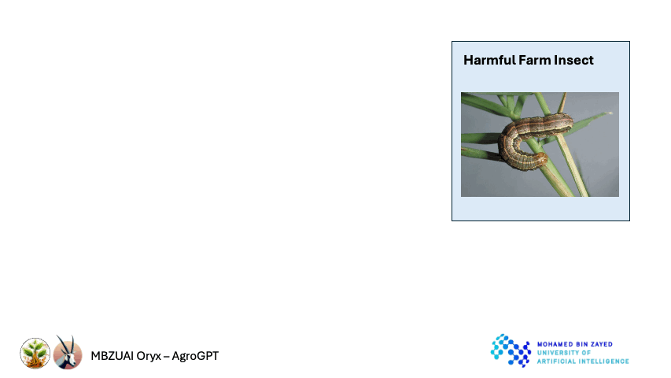
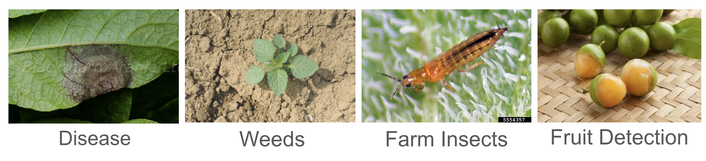
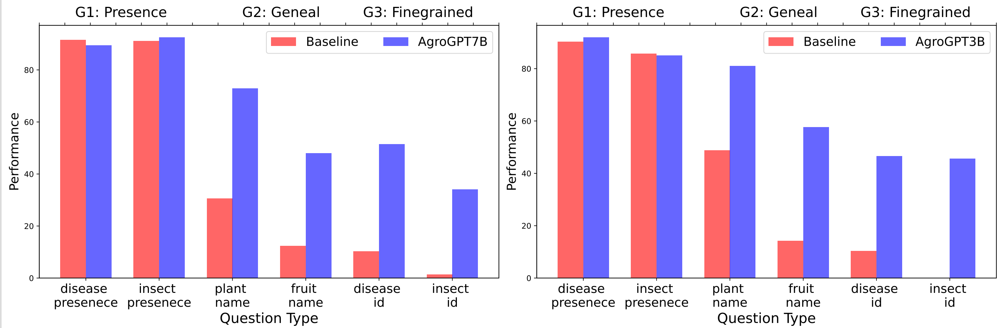
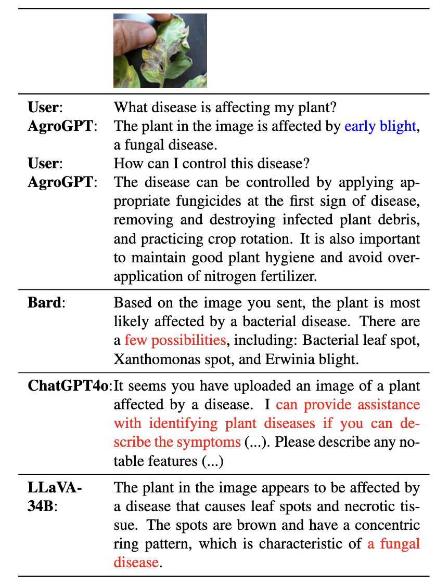
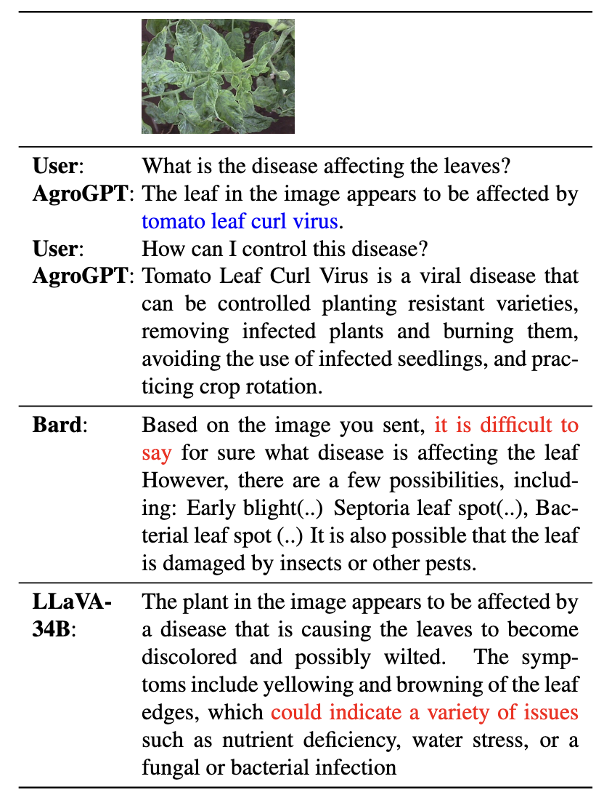

#  AgroGPT: Efficient Agricultural Vision-Language Model with Expert Tuning

<p align="center">
    
</p>

#### [Muhammad Awais](awaisrauf.github.io), [Ali Husain Salem Abdulla Alharthi ](), [Amandeep Kumar](https://virobo-15.github.io/), [Hisham Cholakkal](https://scholar.google.ae/citations?user=bZ3YBRcAAAAJ&hl=fr), [Rao M. Anwer](https://scholar.google.fi/citations?user=_KlvMVoAAAAJ&hl=en)


### Vision-language to have expert conversations about agriculture

[]()
[]()
[]()

---

## 📢 Latest Updates

- **Aug-20-24**: AgroGPT demo and webpage are released. Code, pretrained models, and training/evaluation scripts are coming soon!

---

## Overview

<div align="center">
    <p style="width: 80%;">
    
    </p>
</div>

## 🏆 Contributions

1. We develop AgroGPT: **the first multilingual Large Multimodal Model (LMM)**, capable of responding fine-grained questions about **agriculture**.
2. We developed an expert-tuning data pipeline that can generate an expert-tuning dataset with just image classification-based data. We created a 70k agriculture expert tuning dataset called AgroInstruct.
3. We train models across two distinct scales, 3B and 7B, parameters to demonstrate the scalability of our training pipeline. The models perform well in answering questions related to them.

## 📂 AgroInstruct Dataset and Generation Pipeline
<div align='center'>
    <p style="width: 70%;">
    
    </p>
</div>

We develop a diverse expert tuning set (~70K) comprising conversations about different agricultural subjects. Specifically, our pipeline uses vision-only datasets from four domains (diseases, weeds, insects, and fruits). It synthesizes AgroInstruct, which consists of three types of questions: complex multi-turn conversations, simple questions, and image descriptions.

📥 **Download the Training Dataset:** Access our AgroInstruct dataset: [Coming soon]().

We also develop an evaluation set to conduct a comprehensive evaluation. It is created utilizing the test and a holdout set of datasets utilized to generate AgroInstruct. we create six visual question-answering sets consisting of three groups that test the model's capabilities at different levels.

1. Group 1 consists of questions to ask for the presence of a disease or insect in an image. Since these two attributes are general and coarse, a model trained on general instruction tuning (e.g., visual tuning) can easily answer these questions without expert tuning.
2. Group 2 consists of questions to name general categories such as fruits or plant names. These two attributes are finer-grained than group 1 but are also present in instruction-tuning data.
3. Group 3, however, consists of questions that probe the model for fine-grained and field-specific questions, including the disease's or insect's name.

📥 **Download the Evaluation Dataset:** Access our AgroEval dataset: [Coming Soon]().


## 🧠 Model Zoo

Coming Soon
| Model Name       | Link                                     |
|------------------|------------------------------------------------------|
| AgroGPT-3B  | [Coming Soon]() |
| AgroGPT-7B          | [Coming Soon]()   |


## 🔧 Installation

We recommend setting up a conda environment for the project:

```bash
conda create --name=agroGPT python=3.10
conda activate agroGPT

git clone https://github.com/awaisrauf/agroGPT
cd agroGPT

pip install -r requirements.txt

export PYTHONPATH="./:$PYTHONPATH"
```

### ⚙️ Generating AgroInstruct with Our Pipeline

Coming soon.

### 📐 Generating AgroEvals with Our Pipeline

Coming soon.

### 🏋‍♂ Training

Coming Soon


## 📊 Quantitative Evaluation

Our method works comparable to LMM models for general questions but outperforms them in terms of fine-grained agriculture knowledge.

<p align="center">
  
</p>


## 📚 Qualitative Examples of Multilingual Capabilities


<div aling="center">
    <div>
        
        
        </div>
</div>

## 📜 Citation

```bibtex
  @article{awais2024agroGPT,
  title={},
  author={},
  journal={},
  year={2024},
  url={}
}
```